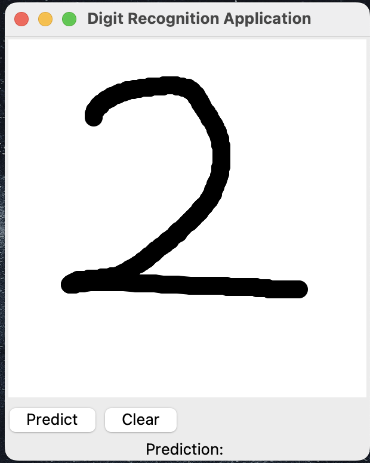

# Digit Recognition Application

The machine learning application that allows users to draw digit on canvas and predicts 
the digit which is drawn.

## Setup

`conda create --name digit-rec-env`

`conda activate digit-rec-env`

`conda install tensorflow scikit-learn numpy pandas matplotlib seaborn pillow`

## Run

`python3 app.py`

## An Overview of Application

### Initial look

### After drawing digit on canvas

### After hitting predict button

